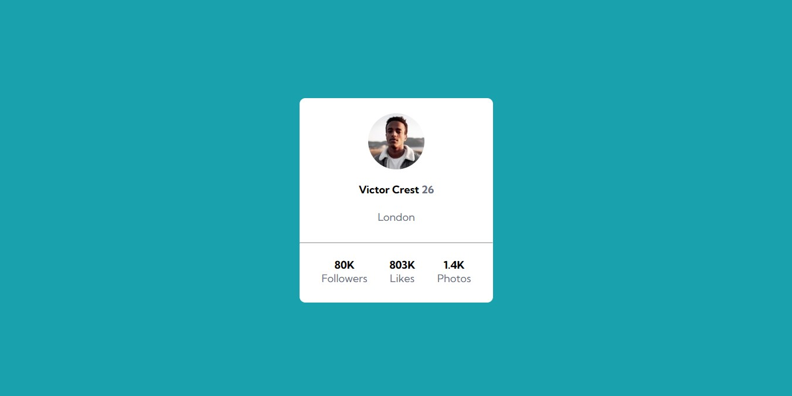

# Exercício HTML + CSS Avançado - Profile Card

Esse exercício é uma ALTERNATIVA ao desafio [Frontend Mentor | Profile card component coding challenge.](https://www.frontendmentor.io/challenges/profile-card-component-cfArpWshJ) Onde o principal desafio é criar um cartão que contenha as informações de perfil. Para ser aprimorado as habilidades de posicionamento de elementos usando flexbox.

## Imagens 

